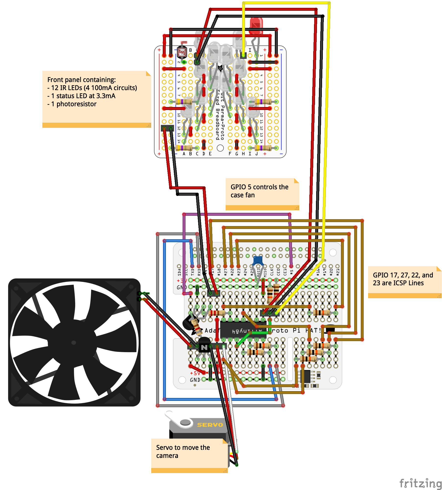

# Protoboard

Watchtower uses two Adafruit prototyping boards and one AVR microcontroller:
- Perma-Proto HAT
   - https://www.adafruit.com/product/2310
   - [Fritzing file](https://github.com/adafruit/Fritzing-Library/blob/master/parts/Adafruit%20Perma-Proto%20HAT.fzpz)
- PermaProto Quarter-sized breadboard
   - https://www.adafruit.com/product/1608
   - [Fritzing file](https://github.com/adafruit/Fritzing-Library/blob/master/parts/PermaprotoQuarterBoard.fzpz)
- ATTiny84A
   - https://www.digikey.com/product-detail/en/microchip-technology/ATTINY84A-PU/ATTINY84A-PU-ND/2774082
   - [Fritzing file](https://github.com/brucetsao/Fritzing/blob/master/ATTiny84-HLT-core.fzpz)

The Perma-Proto HAT sits on top of the Raspberry Pi and contains ports to run the servo, front IR panel, status LED, photoresistor, and case fan. This setup will all fit inside the [case included with the project](../case). The front status LED helps the user know that the infrared lights are turned off. It is connected to the same PWM line as the IR LEDs, so its brightness will update with the front IR panel.

 

Extra connectors are included in the diagram for reprogramming over ISP once the board is installed onto the Pi. These connectors are on pins 1, 4, 7, 8, 9, and 14. There is a jumper that connects the ATTiny84 to the 3v rail of the Pi. For ISP, this jumper must be removed to connect the positive ISP cable to pin 1, which will power the microcontroller. This avoids any backpowering or damage to the Pi when connected to a 5v Arduino.

The microcontroller and photoresistor are powered from the 3v rail. The LEDs, case fan, and servo are powered off of the Pi's 5v rail. For the LEDs, I used a 2N2222 NPN transistor to power from the 5v rail. For the case fan, I used a C1815 NPN transistor. You could use two 2N2222 transistors if you swap the collector and base pins for the fan. Anything will work here as long as the transistor can handle the power requirements of the front IR panel and fan.

The fan's circuit is the only component on the board directly controlled by the Pi. Watchtower uses [Icebox](https://github.com/johnnewman/icebox/) to control the fan. This is automatically installed using Watchtower's install script.

A decoupling capacitor is on the 3v line to help mitigate any noise or voltage drop that might occur while the device is running. [ATTinyCore](https://github.com/SpenceKonde/ATTinyCore) recommends a 0.1uF capacitor. A ceramic capacitor is best since it has the fastest response to voltage changes. This avoids brownout shutdowns or corrupted memory on the microcontroller.

#### Power Requirements

- The front IR panel consumes 120mA of power when using 20mA LEDs.
   - There are 14 infrared LEDs total. Of those, there are 4 parallel circuits that contain 3 LEDs in series. With 20mA LEDS, those 4 parallel circuits pull 80mA. The remaining two LEDs pull 40mA, so the whole front IR panel will use 120mA of power.
- The 30x30mm fan I am using has a current draw of 120mA.
- The status LED draws about 20mA of power.
- A Pi 3B+ [typical draw is 500mA](https://www.raspberrypi.org/documentation/hardware/raspberrypi/power/README.md). Under stress, [this can average 850mA](https://www.raspberrypi.org/documentation/faqs/#power).
- The Pi Camera pulls 250mA.

120mA IR + 120mA fan + 20mA LED + 850mA Pi 3B + 250mA Camera = **1360mA total**.

This isn't factoring in the ATTiny84's current needs at 3v, but this should be negligible (5-10mA). A 2500mA power supply will have plenty of headroom for the micro servo, which will be running in short bursts and will have very little resistance.

#### Full diagram:

#### HAT connections:
