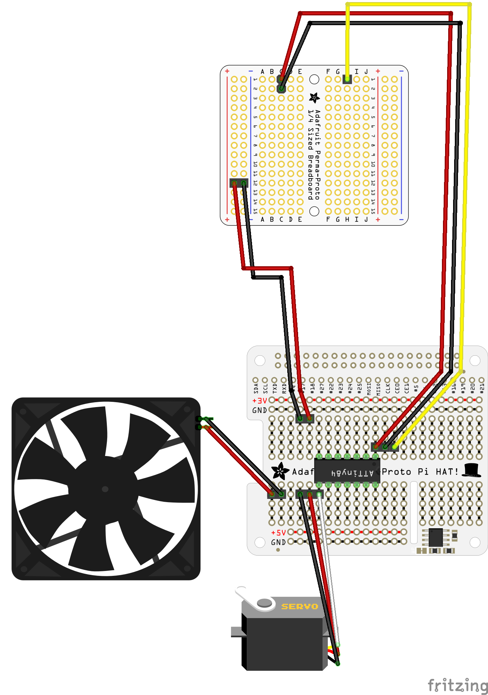

# Hardware

Watchtower uses two Adafruit prototyping boards and one AVR microcontroller:
- Perma-Proto HAT
   - https://www.adafruit.com/product/2310
   - [Fritzing file](https://github.com/adafruit/Fritzing-Library/blob/master/parts/Adafruit%20Perma-Proto%20HAT.fzpz)
- PermaProto Quarter-sized breadboard
   - https://www.adafruit.com/product/1608
   - [Fritzing file](https://github.com/adafruit/Fritzing-Library/blob/master/parts/PermaprotoQuarterBoard.fzpz)
- ATTiny84A
   - https://www.digikey.com/product-detail/en/microchip-technology/ATTINY84A-PU/ATTINY84A-PU-ND/2774082
   - [Fritzing file](https://github.com/brucetsao/Fritzing/blob/master/ATTiny84-HLT-core.fzpz)

The Perma-Proto HAT sits on top of the Raspberry Pi and contains ports to run the servo, front IR panel, status LED, photoresistor, and case fan. This setup will all fit inside the [case included with the project](../case). The front status LED helps the user know that the infrared lights are turned off. It is connected to the same PWM line as the IR LEDs, so its brightness will update with the front IR panel.

_I'm not an electrical engineer, but this setup has worked well for me._

  

Lines to the Raspberry Pi's GPIO pins 17, 27, 22, and 23 are included for ICSP reprogramming of the ATTiny84. This way you don't need to take apart the case to update the microcontroller's software. The pins for the ATTiny84 are broken down [here](https://github.com/SpenceKonde/ATTinyCore/blob/master/avr/extras/ATtiny_x4.md).

The microcontroller, photoresistor, and status LED are all powered from the 3V rail. The IR LEDs, case fan, and servo are powered from Pi's 5V rail. There are two transistors on the board that are both used as "full on" switches. One transistor can turn the fan on and off from the Pi's GPIO pin 5. The other transistor is connected to the ground line for all of the LEDs. Its base pin is connected to PWM pin 6 on the ATTiny84. This allows the microcontroller to adjust the brightness of all the LEDs. Both transistors are NPN S8050's which can handle the high power requirements of the front panel. Anything can work here as long as the transistors can handle the power requirements.

Watchtower uses [Icebox](https://github.com/johnnewman/icebox/) to control the fan. This is automatically installed using Watchtower's install script. Icebox will power on the fan only when the SoC temperature reaches a certain threshold. Once the SoC cools back down, the fan will be powered off.

All lines between the Pi and the Microcontroller (serial and ICSP) are connected to a 10kΩ resistor. This keeps the lines from pulling more than 0.33mA.

A decoupling capacitor is located on the 3V line to help mitigate noise or voltage drop that might occur while the device is running. [ATTinyCore](https://github.com/SpenceKonde/ATTinyCore) recommends a 0.1uF capacitor. A ceramic capacitor is best since it has the fastest response to voltage changes.

### ICSP Instructions (optional)

To program the ATTiny84 using the Raspberry Pi, you will need to compile AVRDUDE with linuxgpio support. This allows AVRDUDE to flash the microcontroller using the Raspberry Pi's GPIO ports. AVRDUDE 6.3 has a bug with linuxgpio, so I am using 6.2.

Commands to install AVRDUDE:
```Bash
sudo apt install bison flex
wget http://download.savannah.gnu.org/releases/avrdude/avrdude-6.2.tar.gz
tar xfv avrdude-6.2.tar.gz 
cd avrdude-6.2/
./configure --enable-linuxgpio
make
sudo make install
sudo nano /usr/local/etc/avrdude.conf 
```
When editing `avrdude.conf`, find the commented out linuxgpio programmer, uncomment it, and update the pin numbers to match the Watchtower setup:
```
programmer
  id    = "linuxgpio";
  desc  = "Use the Linux sysfs interface to bitbang GPIO lines";
  type  = "linuxgpio";
  reset = 17;
  sck   = 27;
  mosi  = 23;
  miso  = 22;
;
```

Now run `sudo avrdude -c linuxgpio -p t84 -v` and you should see output indicating a successful connection to the ATTiny84.

#### Initial setup

To set the clock to 8MHz and enable brown out detection at 2.7 volts:
```Bash
wget https://github.com/SpenceKonde/ATTinyCore/archive/1.4,1_manual.zip
unzip 1.4,1_manual.zip
sudo avrdude -c linuxgpio -p t84 -v -b19200 -e -Uefuse:w:0xFF:m -Uhfuse:w:0b11010101:m -Ulfuse:w:0xE2:m -Uflash:w:ATTinyCore-1.4-1_manual/avr/bootloaders/empty/empty_all.hex:i 
```

You can view this command within the Arduino IDE if you have the [ATTinyCore](https://github.com/SpenceKonde/ATTinyCore) boards installed. Go to Tools > Burn Bootloader with the ATTiny84 board selected:


With verbose logging enabled, you will see the above command in the Arduino console.

#### Installing `controller.ino`

To flash the microcontroller with the `controller.ino` program, you'll need to compile it with the Arduino IDE on any computer. Enable verbose logging in Arduino and attempt to upload the program. You will see a command similar to the following in the console:
```
avrdude ... -Uflash:w:/var/folders/wd/.../controller.ino.hex:i 
```
You can copy the `controller.ino.hex` file from that directory and transfer it to your Raspberry Pi. From there, flash the ATTiny84 with the command:
```Bash
sudo avrdude -c linuxgpio -p t84 -v -b19200 -Uflash:w:controller.ino.hex:i
```

You should see output from AVRDUDE indicating that the program was successfully uploaded and verified. At this point, you are finished!

### Power Requirements

- The front IR panel consumes around 400mA of power when using 100mA IR LEDs.
   - There are 12 infrared LEDs total. Of those, there are 4 parallel circuits that contain 3 LEDs in series. With 100mA LEDS, those 4 parallel circuits pull 400mA. The status LED only pulls 3mA.
- The 30x30mm fan I am using has a current draw of 120mA.
- A Pi 3B+ [typical draw is 500mA](https://www.raspberrypi.org/documentation/hardware/raspberrypi/power/README.md). Under stress, [this can average 850mA](https://www.raspberrypi.org/documentation/faqs/#power).
- The Pi Camera pulls 250mA.

400mA IR + 120mA fan + 850mA Pi 3B + 250mA Camera = **1620mA total**.

This isn't factoring in the ATTiny84's current draw at 3V, but this should be negligible. A 2500mA power supply will have plenty of headroom for the micro servo, which will be running in short bursts and will have very little physical resistance when it moves.

### Full diagram:


### HAT connections:
